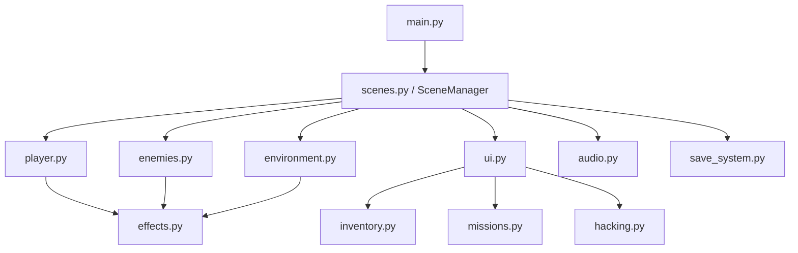
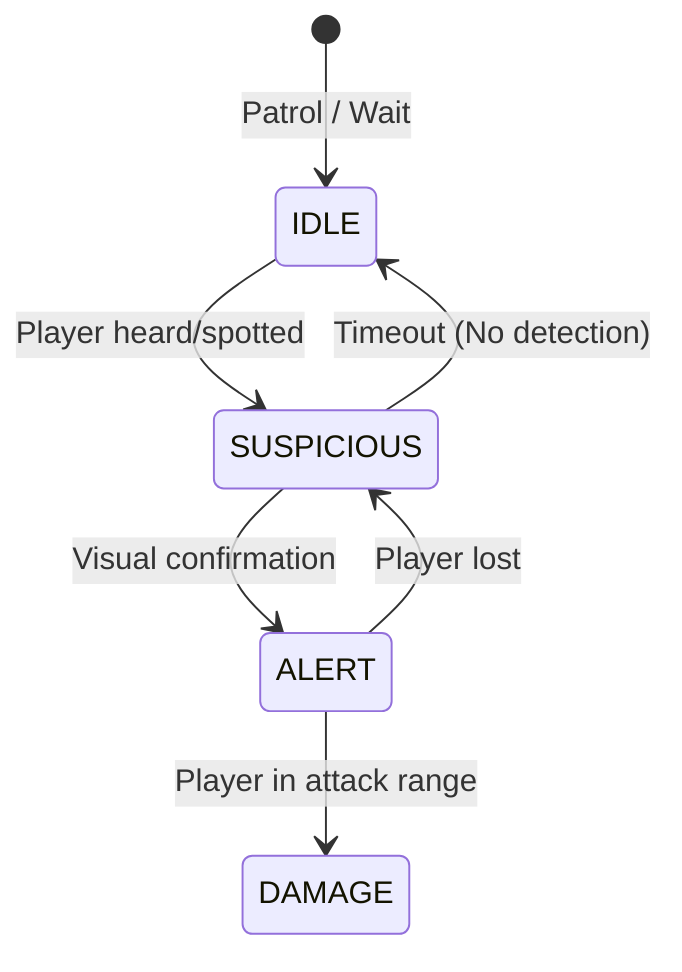

# AIM: Cyber Reign
## AAA Technical & Game Design Document
**Version:** 0.8.0 | **Author:** Aimtech | **Engine:** Ursina Engine (Python)

---

## 1. Project Overview

**AIM: Cyber Reign** is a cyberpunk-themed first-person stealth and hacking game developed in Python using the Ursina engine. Set in a dystopian, corporatocracy-ruled megacity, the player assumes the role of a rogue operative tasked with infiltrating high-security mainframes. 

The core gameplay loop centers around exploring a dense, neon-lit environment, avoiding or neutralizing AI-controlled security drones, hacking server terminals via a high-stakes mini-game, managing resources seamlessly through a quick-slot inventory, and ultimately escaping the sector.

### Target Audience
Fans of immersive sims, cyberpunk aesthetics, and strategic stealth-action games (e.g., *Deus Ex*, *Cyberpunk 2077*, *System Shock*).

---

## 2. Game Features

The game is currently at **Phase 8 (Polish & Final Touches)**, delivering a fully playable vertical slice:

- **Immersive First-Person Movement:** Weighted FPS controller featuring head bobbing, sprinting momentum, jumping, and camera shake feedback.
- **Hacking Mini-game:** A real-time, time-pressured sequence matching challenge that scales in difficulty and raises security alerts upon failure.
- **Advanced Drone AI:** Autonomous security drones with a 3-state finite state machine (Idle, Suspicious, Alert), vision cones, and distance-based LOD (Level of Detail) optimizations.
- **Modular Mission System:** A dynamic objective tracker capable of handling multi-stage missions (e.g., "Sector Breach": Hack terminals → Reach Extraction).
- **Inventory & Equipment:** 8-slot stacking inventory system with Q/R quick-use bindings for tactical items (Energy Cells, Hack Boosters, EMP Pulses).
- **Dynamic Audio Engine:** Context-aware background music and positional sound effects for footsteps, drones, and UI interactions.
- **AAA Visual Polish:** Distance-fading neon glow, damage vignettes, health bar interpolation, particle bursts, and camera shake.
- **Persistence:** JSON-based save/load system supporting auto-saves upon key objective completions.

---

## 3. Architecture & File Structure

The project strictly follows a modular, decoupled architecture avoiding tightly bound singletons where possible. `SceneManager` handles global orchestration, passing dependencies down to sub-controllers.

### Directory Tree

```text
cyberpunk_game/
├── main.py                    # Entry point; initializes Ursina and SceneManager
├── src/
│   ├── config.py              # Global constants (physics, UI, balance, colors)
│   ├── scenes.py              # State machine for game scenes (Menu, Gameplay, Death)
│   ├── player.py              # FirstPersonController override + physics
│   ├── enemies.py             # SecurityDrone entity and FSM AI
│   ├── hacking.py             # UI overlay and input logic for the hacking minigame
│   ├── missions.py            # Objective tracking and mission progression
│   ├── inventory.py           # Inventory data structure and Equipment Manager
│   ├── items.py               # Item definitions (EnergyCell, EMP, HackBooster)
│   ├── environment.py         # 3D level generation and prop placement
│   ├── effects.py             # Visual effects (GlowPulse, ParticleEmitter, CameraFX)
│   ├── audio.py               # Resource loading and volume management
│   ├── save_system.py         # JSON serialization/deserialization for save states
│   └── ui.py                  # Main HUD overlay (Health, Objectives, Inventory)
├── assets/                    # Audio files, fonts, and textures
├── saves/                     # Auto-generated directory for savegame.json
└── docs/                      # Technical documentation
```

### Dependency Graph



---

## 4. Core Systems Documentation

### 4.1 Player Controller (`player.py`)
A custom subclass extending Ursina's `FirstPersonController`. It handles gravity, jump velocity, crouch/sprint modifiers, and integrates `CameraFX` for realistic head bobbing based on movement velocity.

### 4.2 Security Drone AI (`enemies.py`)
Drones use a lightweight Finite State Machine (FSM) evaluated per-frame. To guarantee high frame rates in dense environments, drones far from the player (>50 units) skip complex logic checks, and idle drones utilize frame-skipping (updating every second frame, staggered).

**AI State Machine:**


### 4.3 Hacking Mini-game (`hacking.py`)
Invoked via interaction rays cast from the player camera. The game overlays a transparent UI panel displaying a target key sequence (e.g., `W - A - S - D - E`).
- **Input tracking:** Listens for `input(key)`. Correct keys advance the index; incorrect keys trigger camera shake, an error SFX, and subtract time.
- **Outcomes:** Success grants access and advances mission objectives. Failure increments the global sector `ALERT_LEVEL`.

### 4.4 Inventory & Equipment (`inventory.py`)
Data-driven inventory tracking slots, counts, and max stacks. The `EquipmentManager` maps assigned `Item` objects to `Q` and `R` keys, managing independent cooldown timers.
- **Example:** `EMP Pulse` instantiated via `items.py` temporarily alters `gameState` to override drone AI to a stunned state.

---

## 5. Gameplay & Mechanics

### Control Scheme
| Input | Action |
|-------|--------|
| `W A S D` | Movement |
| `Mouse` | Look / Turn |
| `Shift` | Sprint (increases footstep intervals speed) |
| `Space` | Jump |
| `E` | Contextual Interact (Hack Terminal, Extract) |
| `TAB` | Toggle Inventory Screen |
| `1 - 8` | Equip item to primary slot (Q) from inventory |
| `Q / R` | Use equipped consumable / gadget |
| `ESC` | Pause Menu / Abort Hack |

### Alert Progression
Global security is tracked via an `Alert Level` (1-100). 
- Failed hacks or detection by drones raises the alert level.
- High alert levels increase drone patrol speeds and detection cones.

---

## 6. Visual & Audio Systems

### Visual Polish (`effects.py`)
To maintain compatibility with lower-end hardware and containerized execution, the game avoids heavy shader passes, utilizing clever generic entity manipulation:
- **GlowPulse:** Modulates scale and alpha on `unlit=True` rings attached to interactive elements to simulate bloom/neon.
- **CameraFX:** Employs a decaying random offset algorithm for screen shake during hits or EMP deployments.
- **HUD Animations:** The health bar uses `lerp(bar.scale_x, target_width, dt * SPEED)` for smooth deceleration, changing color (Green → Yellow → Red) dynamically. A transparent red vignette quad flashes uniformly over the screen during damage.

### Audio Manager (`audio.py`)
Operates gracefully even if assets are missing.
- Streams `.wav` / `.ogg` files through `Audio(..., loop=True)`.
- Tracks categorize into `Music` and `SFX` layers, controllable via global volume sliders in the pause menu.

---

## 7. Configuration & Tuning (`config.py`)

All magic numbers are centralized in `config.py` to allow non-programmers or level designers to balance the game without delving into source code.

**Excerpt from `config.py`:**
```python
# --- Gameplay Tuning ---
PLAYER_SPEED_WALK   = 6.0
PLAYER_SPEED_SPRINT = 10.0
HEALTH_MAX          = 100.0
HEALTH_REGEN_RATE   = 2.0    # HP per second

# --- Security Drones ---
DRONE_DETECT_RADIUS = 15.0
DRONE_DAMAGE_PER_SEC= 10.0
DRONE_PATROL_RADIUS = 8.0

# --- VisualFX ---
CAMERA_SHAKE_DAMAGE_INTENSITY = 0.15
HEALTH_BAR_LERP_SPEED         = 4.0
VIGNETTE_FADE_SPEED           = 3.0
```

---

## 8. Saving & Loading System (`save_system.py`)

The game automatically saves progress upon bridging critical mission milestones (breaching a network node, reaching the extraction point).

**Data Flow:**
1. `scenes.py` triggers `save_system.save_game(player, game_state, inventory, mission_manager)`
2. The system serializes relevant vectors and states into a dictionary.
3. Written asynchronously to `saves/savegame.json`.

**JSON Example Structure:**
```json
{
  "version": "0.8.0",
  "timestamp": "2026-04-02T19:20:01",
  "player": {
    "position": [ 12.5, 1.0, -4.2 ],
    "rotation": [ 0.0, 95.2, 0.0 ]
  },
  "game_state": {
    "health": 85.0,
    "alert_level": 30.0,
    "breached_terminals": ["terminal_01"]
  },
  "inventory": {
    "slots": [
      {"item_id": "energy_cell", "count": 2},
      {"item_id": "emp_pulse", "count": 1}
    ]
  },
  "mission": {
    "current_mission": "sector_breach",
    "completed_objectives": ["hack_2_terminals"]
  }
}
```

---

## 9. Deployment & Build Instructions

The game is designed to be highly portable, packaged via standard Python environments or Docker.

### Local Execution
```bash
# 1. Clone repository
git clone https://github.com/Aimtech/cyber_reign.git
cd cyber_reign

# 2. Install dependencies (Ursina)
pip install -r requirements.txt

# 3. Generate Audio (First Setup Only)
python generate_placeholder_audio.py

# 4. Launch Game
python main.py
```

### Docker Execution (Container Ready)
*Note: Due to X11/OpenGL requirements for Ursina, Docker execution requires volume mounting the host X server on Linux.*
```bash
docker build -t aim_cyber_reign .
docker run -it -v /tmp/.X11-unix:/tmp/.X11-unix -e DISPLAY=$DISPLAY aim_cyber_reign
```

---

## 10. Known Issues & Future Polish (TODO)

- **Collision Glitches:** Rarely, sprinting at a sharp angle into a pillar may cause clipping. Requires deeper Ursina raycast tuning.
- **Audio Overlap:** Multiple drones triggering `SFX_DRONE_CHASE` concurrently can cause phasing. Needs sound concurrency limits in `AudioManager`.
- **Planned Feature:** Stealth kill / takedown mechanics from behind drones.
- **Planned Feature:** Post-processing shaders (requires moving off Ursina's default unlit renderer to custom GLSL shaders).

---

## 11. Appendix & Glossary

- **LOD (Level of Detail):** A technique where objects far from the camera perform fewer calculations to save CPU cycles.
- **EMP (Electromagnetic Pulse):** A tactical item that disables drone FSM updates temporarily.
- **Vignette:** A red quad layered on the camera UI layer that fades dynamically to simulate player injury.
- **Ursina Engine:** A lightweight Python 3D engine built on top of Panda3D. Used for rapid cross-platform prototyping.

---
*Generated by technical documentation systems — AIM: Cyber Reign v0.8.0*
